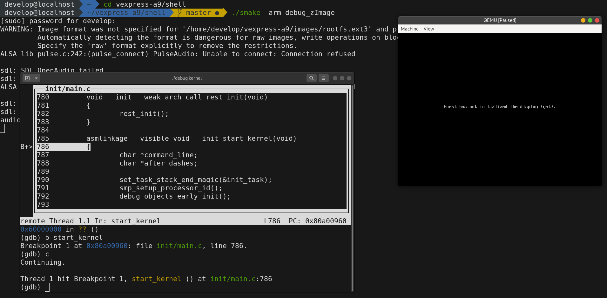

# simple linux kernel learning environment with qemu 

[TOC]

**Config environment using Fedora32 can refer this document [envoirnment setup](./doc/Setup-develop-environment.md)**

**for ubuntu20.04, refer this [setup4ubuntu20.04](./doc/Setup-develop-environment_ubuntu20.04.md)**

## **support architecture now**

* vexpress-a9

## **snap**



## **usage**

* **run command** `cd shell;./smake`

```markdown
now support architecture as below:
      arm, vexpress-a9 board emulated
usage:
  arm, enter as below for help: 
     ./smake -arm

```

* **run command**  cd shell;./smake -arm`

```markdown
usage for arm:
  ./smake -arm zImage                -- cross-complie linux kernel zImage 
  ./smake -arm uImage                -- cross-complie linux kernel uImage 
  ./smake -arm uboot                 -- cross-complie uboot
  ./smake -arm busybox               -- cross-complie busybox
  ./smake -arm rootfs                -- create rootfs ext3 image
  ./smake -arm clean_rootfs          -- clean rootfs dir
  ./smake -arm run_uboot             -- run uboot in qemu without graphic
  ./smake -arm run_zImage            -- run zImage in qemu with graphic
  ./smake -arm debug_uboot           -- debug uboot use gdb in qemu without graphic
  ./smake -arm debug_zImage          -- debug zImage use gdb in qemu with graphic
  ./smake -arm clean_boot            -- clean uboot,reserve config
  ./smake -arm clean_kernel          -- clean kernel,reserve config
  ./smake -arm disclean_boot         -- deep clean uboot
  ./smake -arm distclean_kernel      -- distclean kernel
  ./smake -arm clean_busybox         -- clean busybox
  ./smake -arm distclean_busybox     -- distclean busybox
  ./smake -arm setup_net             -- setup net connection with qemu
  ./smake -arm modules xxx           -- make kernel modules in src/modules/xxx
  ./smake -arm modules clean xxx     -- clean kernel modules in src/modules/xxx
```
